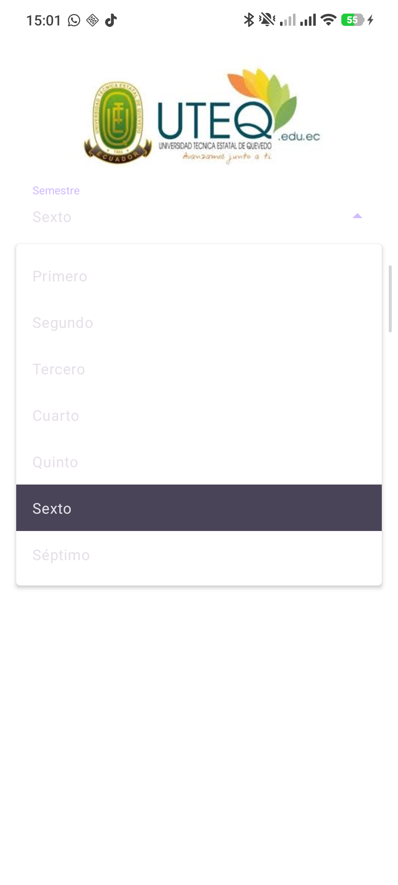
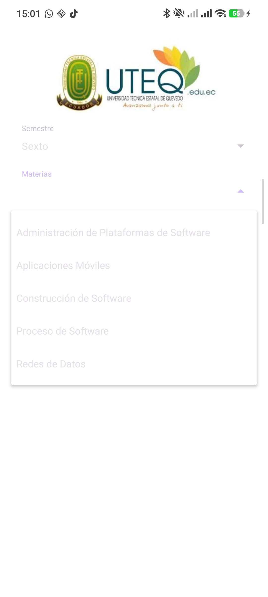
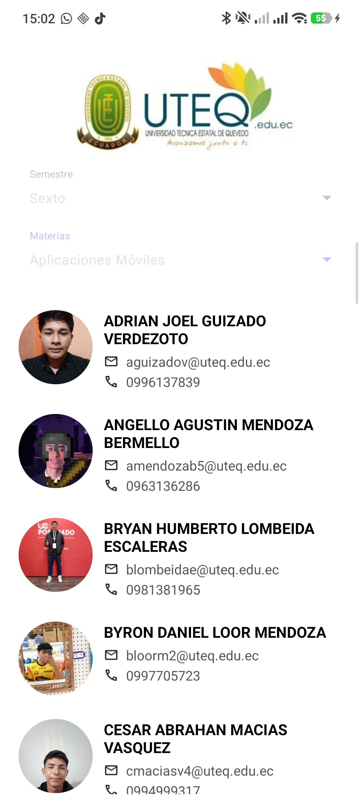

# TA1 - Consulta de Alumnos con Supabase

Aplicación nativa Android desarrollada en Kotlin que consulta información de alumnos almacenada en una base de datos Supabase y la muestra en un ListView con un diseño personalizado.

## Funcionalidades

- Consulta de alumnos desde la tabla `alumnos` en Supabase
- Selección de semestre y materia mediante dropdowns
- Visualización de alumnos en ListView con diseño personalizado
- Fotografía del alumno cargada dinámicamente con Glide (transformación circular)
- Iconos descriptivos para correo electrónico y teléfono
- Ordenamiento alfabético de alumnos por nombre

## Tecnologías Utilizadas

- **Lenguaje:** Kotlin
- **IDE:** Android Studio
- **Base de datos:** Supabase (PostgreSQL)
- **SDK:** Supabase PostgREST Kotlin
- **Carga de imágenes:** Glide
- **Diseño:** ConstraintLayout, LinearLayout, ListView, AutoCompleteTextView

## Requisitos

- Android Studio (versión más reciente recomendada)
- JDK 11 o superior
- Dispositivo Android con API 34 o superior (minSdk 34)
- Cuenta en Supabase con una tabla `alumnos` configurada

## Instalación y Configuración

### 1. Clonar el repositorio

```bash
git clone https://github.com/Kinetro/TA1.git
cd TA1
```

### 2. Abrir en Android Studio

- Abrir Android Studio
- Seleccionar **Open an Existing Project**
- Navegar hasta la carpeta `SUPABASESDK`

### 3. Configurar credenciales de Supabase

El archivo `local.properties` (ya excluido del control de versiones) debe contener:

```properties
sdk.dir=C\:\\Users\\<tu_usuario>\\AppData\\Local\\Android\\Sdk
SUPABASE_URL=https://<tu_proyecto>.supabase.co
SUPABASE_KEY=<tu_supabase_anon_key>
```

**Importante:** Las credenciales NO deben subirse al repositorio. El archivo `.gitignore` ya está configurado para excluir `local.properties`.

### 4. Estructura de la tabla `alumnos` en Supabase

La tabla debe tener los siguientes campos:

| Campo     | Tipo    | Descripción          |
|-----------|---------|----------------------|
| id        | integer | Identificador único  |
| nombres   | text    | Nombres completos    |
| correo    | text    | Correo electrónico   |
| telefono  | text    | Número telefónico    |
| foto      | text    | URL de la fotografía |

### 5. Ejecutar la aplicación

- Conectar un dispositivo o iniciar un emulador
- Click en **Run 'app'** (▶) o `Shift + F10`

## Estructura del Proyecto

```
SUPABASESDK/app/src/main/
├── java/com/example/supabasesdk/
│   ├── MainActivity.kt          # Actividad principal
│   ├── adapter/
│   │   └── AlumnoAdapter.kt     # Adaptador personalizado para ListView
│   ├── api/
│   │   └── SupabaseManager.kt   # Gestor de conexión a Supabase
│   └── model/
│       ├── Alumno.kt            # Modelo de datos del alumno
│       └── Materia.kt           # Modelo de datos de materia
└── res/
    ├── layout/
    │   ├── activity_main.xml    # Diseño de la pantalla principal
    │   └── item_alumno.xml      # Diseño personalizado del ítem del ListView
    └── drawable/                # Recursos gráficos (logo, iconos)
```

## Capturas de la Aplicación

### App al iniciar


### Selector de semestre


### Selector de materia


### Lista de alumnos


## Repositorio

URL: https://github.com/Kinetro/TA1.git
